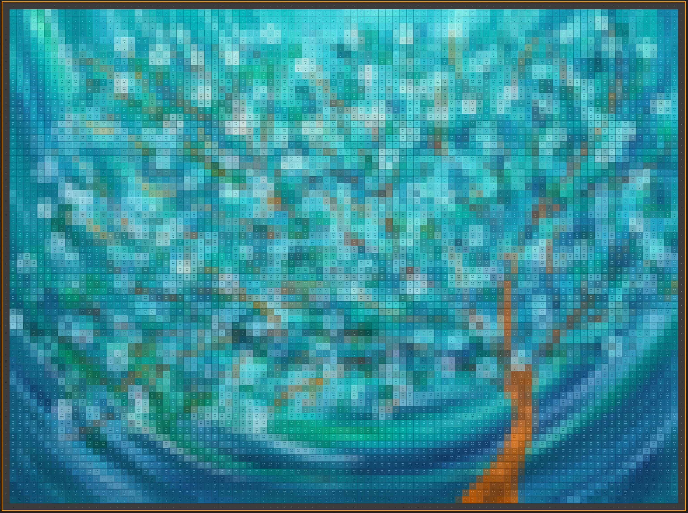
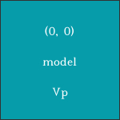
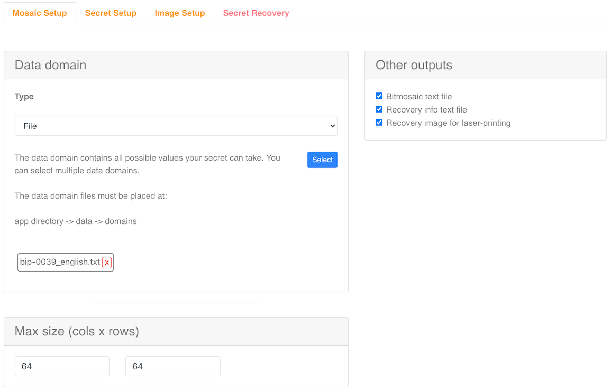
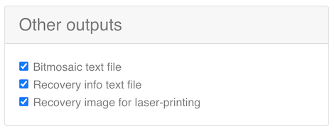
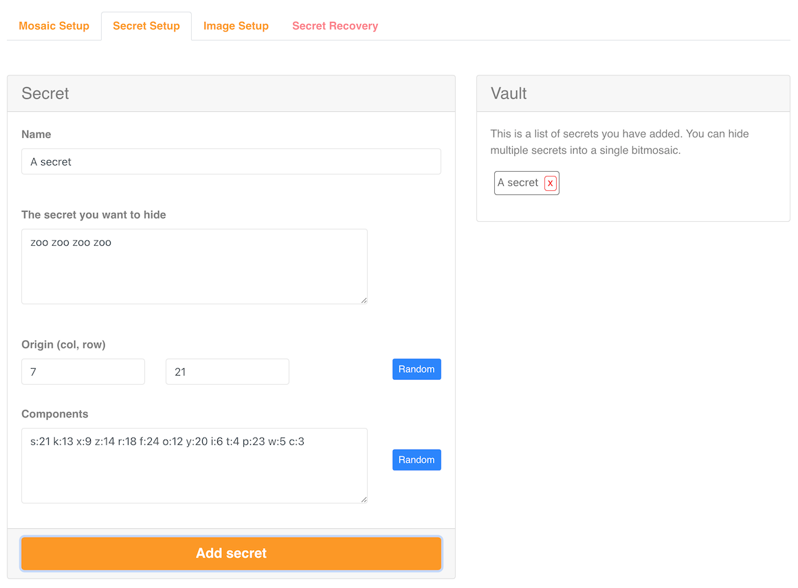
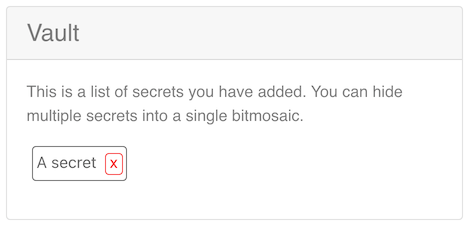
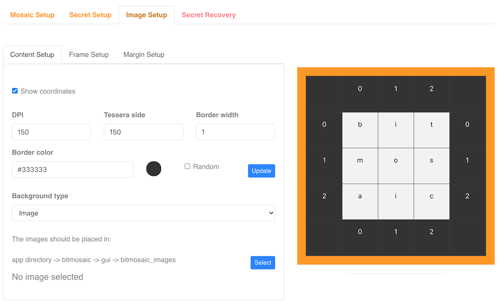
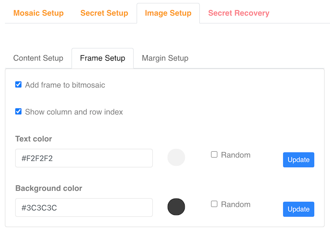
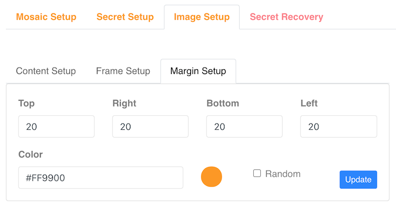
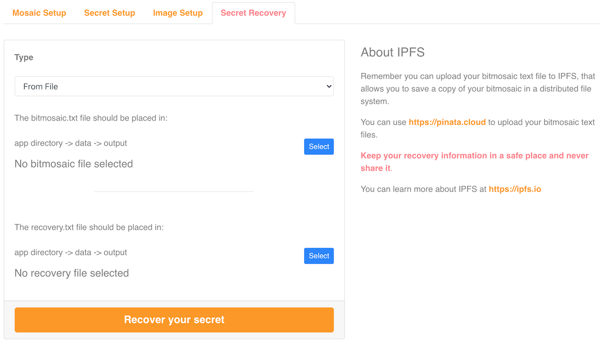

# Bitmosaic

### Your secrets in pixel art  


Bitmosaic is an open-source application which allows you to hide your secrets (i.e. your wallet's seed) into an image.  

It also provides a coordinate system to recover your secrets.  

## Features
<hr>

  1. Hide secrets

     * Multi-secret: you can hide multiple secrets in the same bitmosaic.
     * Multi-data-domain: you can use as many domains as you want to hide your secret(s), including bip-39 wordlists.
     * Custom-data-domain: you can create as many domain files as you want to be used to hide your secret(s).
     * Regex-data-domain: you can use regular expressions as data domains. 
     * Multi-language: secrets can be written in multiple languages (this is good for bip-0039 wordlists).
     * Randomize: use the randomize buttons to make unpredictable selections.
     * Laser-print: save the recovery info into a file ready for laser printing.
     * Choose which extra files you want to save.
     

  2. Highly configurable image

     * Add or remove the image frame.
     * Set the image size by selecting the number of columns and rows, the DPI and the tessera (cell) side to adjust the final image size.
     * Select color for text, borders, backgrounds...
     * Select the tessera border width.
     * Show coordinates in tessera to make it more accesible when recovering the secret.
     * Choose the background type: you can use a random color palette or you can also select an image to create a pixel art bitmosaic image.


  3. Recover your secrets

     * You can use the bitmosaic.txt file and the recovery_<secret_name>.txt files to recover your secrets.
     * Or you can use the bitmosaic.txt file and enter the recovery information manually.  

## Introduction
<hr>
Bitmosaic was conceived to hide secrets with style ;-)

You can hide passwords, texts, numbers, etc. The bitmosaic can be used as a mechanism for secret communication, hiding your secret messages and
sharing the recovery info with the other side.

Another possible application is cryptocurrencies. The first thing you realize when you enter into the cryptocurrencies world is:

__How and where should I store my private keys, wallet seed, hardware wallet pin, password, etc.?__

You should save all these secrets in as many secure places as you can and... there is a bitmosaic for that!  

The idea is simple: create an image where you can hide all these secrets. This image is called a __bitmosaic__ and it can be printed to decorate your house, your office or many other places.  

<div style="text-align: center;">
     


Winter Morning Tree by [Louise Mead](https://www.louisemead.co.uk/collections/wall-art/products/winter-morning-tree-canvas-print) ([1](#note1))

</div>


The bitmosaic is made of __tesserae__ (cells), which contains the following information: 

   * The position in the bitmosaic as __(col, row)__ point.
   * The __data__ to be hidden.
   * A __vector__ to get the _next tessera_.  
     This vector is codified into two letters. This pair of letters can be lowercase (addition) or uppercase (substraction).

<div style="text-align: center;">


     
A tessera

</div>

In this example, to get the coordinates for the next _tessera_, we have to __substract the value of _'v'___ from the _col_ value and __add the value of _'p'___ to the _row_ value in the current _tessera_.  

## Getting Started
<hr>
To run this project you have to install Python 3.9.0. Python can be downloaded from [here](https://www.python.org/downloads/)  

You also need to have installed at least one of the following web browsers: Chrome, Edge or Firefox.

Once you have Python installed, you need to clone this repository in your local machine and install its dependencies ([Eel](https://github.com/ChrisKnott/Eel), [Pillow](https://github.com/python-pillow/Pillow) and [Xeger](https://github.com/crdoconnor/xeger)).

If you would like to enter paranoid-mode when working with sensitive information (like the secrets you can hide in bitmosaic), do it!.  

You can disconect your computer from internet.

You can also start with a live OS distribution or a virtual machine and, after the application is ready, remove your internet connection.  

When you feel confortable with your paranoid-setup, you need to run:

```bash
   git clone https://github.com/bitmosaic/bitmosaic.git
   cd bitmosaic
   pip3 install -r requirements.txt  .
   python3 bitmosaic.py <chrome|edge>
```

The default web browser is __Chrome__.  

## The Interface
<hr>  

### The mosaic setup tab

<div style="text-align: center;">



</div>


In this first tab you need to choose the _data domain(s)_. Each data domain can be a utf-8 txt file containing all possible values the secret can take, 
or a regular expression.

By default, the __bip-0039_english.txt__ data domain is selected. 

If you add multiple data domains, then you can create secrets mixing the elements in each domain.  

The max size for the bitmosaic can be set is in this tab too. The size values are for columns and rows (width and height). This is the maximum number of _tesserae_ the mosaic can have.


<div style="text-align: center;">



</div>

Here you can choose if you want to save additional files like the bitmosaic and the recovery information as txt files. The recovery information can also be saved in image format for laser printing.

### The secret(s) setup tab

In this tab is where you set up the secret(s) you want to hide into the bitmosaic.

<div style="text-align: center;">



</div>

A secret is made of a __name__, __the secret we want to hide__, an __origin__ (the coordinates, in column and row format, where the first secret's element will be placed), and a set of __components__ (the values which will be used to compute the coordinates for the next element).
The components should be written in ___letter:number___ format, and separated by spaces (a:0 b:1 c:2).  

<div style="text-align: center;">



</div>

The vault is where you can see the secrets you have added to be hidden in the bitmosaic. You can also remove secrets.


### The image setup tab

In the image setup tab is where the appearance of the bitmosaic is set up. You can change the DPI and the tessera side. This two parameters (and the size for the bitmosaic configured in the mosaic setup tab) affects to the bitmosaic's printing size.


<div style="text-align: center;">



</div>

You can set the bitmosaic content, frame and margin properties.  

#### The content setup sub-tab

In the __content setup__ sub-tab you can choose to show or hide the tessera coordinates, change the border width and the external border color.  

Here is where you can choose an image to use as the main image for your bitmosaic or create a bitmosaic with some random colors (based in a color of your election).

#### The frame setup sub-tab

In the __frame setup sub-tab__ you can choose to put or remove the bitmosaic's external frame. You can also show or hide the column and row index in the frame.

You can change the text color for the row and column indexes and the frame's background color.

<div style="text-align: center;">



</div>

#### The margin setup sub-tab

You can configure the margin values for top, right bottom and left for the bitmosaic. This is useful if you want to print the bitmosaic.

The color for the margin can also be chosen here.

<div style="text-align: center;">



</div>

### The secret recovery tab

In this tab is where you can recover your secret.  

<div style="text-align: center;">



</div>

This is only possible if you have the bitmosaic.txt file (in which your secret is hidden), and the recovery information needed to recover the secret. This recovery information can be read from a recovery info txt file (if you choose to save it) or can be entered manually.

## License
<hr>

This project is lincensed under the terms of the [GNU General Public License version 3](https://www.gnu.org/licenses/gpl-3.0.en.html).


## Donations
<hr>

If you like this project you can help me by making a donation. Please visit [bitmosaic.org](https://bitmosaic.org)

You have many options and ways to do it.

##Notes
<hr>

<a id="note1">1</a> I'm not related in any way to Louise Mead. Her Winter Morning Tree was used as bitmosaic's background example to make this readme file. 
